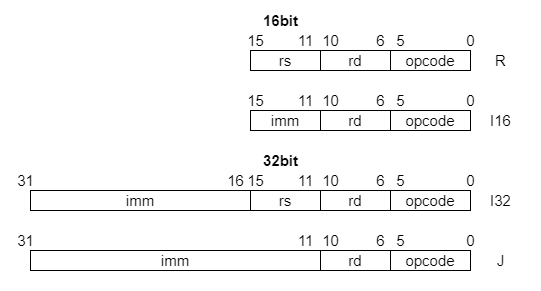
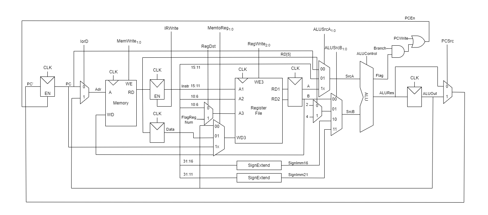
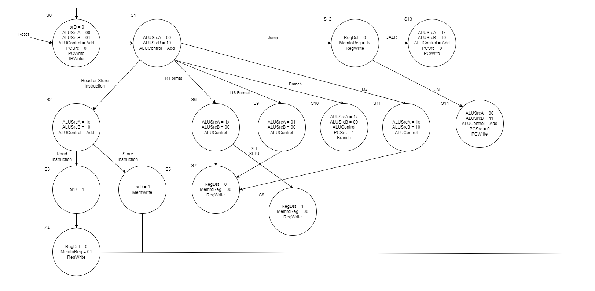

# KTC32

A hobby 32-bit CPU implemented in SystemVerilog

## Related Repo

### ktc32 assembler

[ktc32-asm](https://github.com/kinpoko/ktc32-asm)

### ktc32 emulator written in Rust

[ktc32-emu](https://github.com/kinpoko/ktc32-emu)

## Instruction Set

KTC32 has four formats of instruction.



| Instruction | Format | Opcode | Description                                    | Assembly          |
| ----------- | ------ | ------ | ---------------------------------------------- | ----------------- |
| MOV         | R      | 000000 | x[rd] = x[rs]                                  | mov rd, rs        |
| ADD         | R      | 000001 | x[rd] = x[rd] + x[rs]                          | add rd, rs        |
| SUB         | R      | 000010 | x[rd] = x[rd] - x[rs]                          | sub rd, rs        |
| AND         | R      | 000011 | x[rd] = x[rd] & x[rs]                          | and rd, rs        |
| OR          | R      | 000100 | x[rd] = x[rd] \| x[rs]                         | or rd, rs         |
| XOR         | R      | 000101 | x[rd] = x[rd] \^ x[rs]                         | xor rd, rs        |
| SLL         | R      | 000110 | x[rd] = x[rd] << x[rs]                         | sll rd, rs        |
| SRL         | R      | 000111 | x[rd] = x[rd] >><sub>u</sub> x[rs]             | srl rd, rs        |
| SRA         | R      | 001000 | x[rd] = x[rd] >><sub>s</sub> x[rs]             | sra rd, rs        |
| SLT         | R      | 001001 | flag = (x[rd] <<sub>s</sub> x[rs])? 1 : 0      | slt rd, rs        |
| SLTU        | R      | 001010 | flag = (x[rd] <<sub>u</sub> x[rs])? 1 : 0      | sltu rd, rs       |
| SLLI        | I16    | 010000 | x[rd] = x[rd] << imm                           | slli rd, imm      |
| SRLI        | I16    | 010001 | x[rd] = x[rd] >><sub>u</sub> imm               | srli rd, imm      |
| SRAI        | I16    | 010010 | x[rd] = x[rd] >><sub>s</sub> imm               | srai rd, imm      |
| ADDI        | I32    | 100000 | x[rd] = x[rs] + sext(imm)                      | addi rd, rs, imm  |
| ANDI        | I32    | 100001 | x[rd] = x[rs] & sext(imm)                      | andi rd, rs, imm  |
| ORI         | I32    | 100010 | x[rd] = x[rs] \| sext(imm)                     | ori rd, rs, imm   |
| XORI        | I32    | 100011 | x[rd] = x[rs] \^ sext(imm)                     | xori rd, rs, imm  |
| SLTI        | I32    | 100100 | x[rd] = (x[rs] <<sub>s</sub> sext(imm))? 1 : 0 | slti rd, rs, imm  |
| SLTIU       | I32    | 100101 | x[rd] = (x[rs] <<sub>u</sub> sext(imm))? 1 : 0 | sltiu rd, rs, imm |
| BEQ         | I32    | 100110 | if(x[rd] == x[rs]) pc += sext(imm)             | beq rd, rs, imm   |
| BNQ         | I32    | 100111 | if(x[rd] != x[rs]) pc += sext(imm)             | bnq rd, rs, imm   |
| BLT         | I32    | 101000 | if(x[rd] <<sub>s</sub> x[rs]) pc += sext(imm)  | blt rd, rs, imm   |
| BGE         | I32    | 101001 | if(x[rd] >=<sub>s</sub> x[rs]) pc += sext(imm) | bge rd, rs, imm   |
| BLTU        | I32    | 101010 | if(x[rd] <<sub>u</sub> x[rs]) pc += sext(imm)  | bltu rd, rs, imm  |
| BGEU        | I32    | 101011 | if(x[rd] >=<sub>u</sub> x[rs]) pc += sext(imm) | bgeu rd, rs, imm  |
| JALR        | I32    | 101100 | x[rd] = pc, pc = (x[rs] + sext(imm))           | jalr rd, rs, imm  |
| LB          | I32    | 101101 | x[rd] = sext(M[x[rs] + sext(imm)][7:0])        | lb rd, rs, imm    |
| LH          | I32    | 101110 | x[rd] = sext(M[x[rs] + sext(imm)][15:0])       | lh rd, rs, imm    |
| LBU         | I32    | 101111 | x[rd] = M[x[rs] + sext(imm)][7:0]              | lbu rd, rs, imm   |
| LHU         | I32    | 110000 | x[rd] = M[x[rs] + sext(imm)][15:0]             | lhu rd, rs, imm   |
| LW          | I32    | 110001 | x[rd] = M[x[rs] + sext(imm)]                   | lw rd, rs, imm    |
| LUI         | I32    | 110010 | x[rd] = sext(imm) << 16                        | lui rd, imm       |
| SB          | I32    | 110011 | M[x[rs] + sext(imm)] = x[rd][7:0]              | sb rd, rs, imm    |
| SH          | I32    | 110100 | M[x[rs] + sext(imm)] = x[rd][15:0]             | sh rd, rs, imm    |
| SW          | I32    | 110101 | M[x[rs] + sext(imm)] = x[rd]                   | sw rd, rs, imm    |
| JAL         | J      | 111111 | x[rd] = pc, pc += sext(imm)                    | jal rd, imm       |

## Design

### RTL



### FSM



## Running Test Benches

```bash
make
```

### Required

- [ktc32-asm](https://github.com/kinpoko/ktc32-asm)

- Icarus Verilog

## Reference

デイビット・マネー・ハリス、サラ・L・ハリス (2009) 『ディジタル電子回路とコンピュータアーキテクチャ 第 2 版』(天野英晴・鈴木貢・中條拓伯・永松礼夫訳) 翔泳社(Digital Design and Computer Architecture Second Edition)
